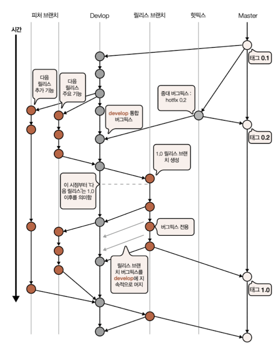

# GIT 협업 패턴

## 깃플로(Git Flow)

| 특성        ||
|-----------|---|
| 개발 브랜치    |피처 단위 브랜치|
| 머지 전략     |패스트 포워드 없음|
| 히스토리 리베이스 |리베이스 없음|
| 릴리즈 전략    | 릴리스 브랜치 분리|

기본적으로 `devlop`과 `master` 라는 두 개의 장기 지속 브랜치를 갖으며, `feature` 브랜치에서 기능 개발을 진행하고, 핫픽스가 필요한 경우 `hotfix` 브랜치에서 개발을 진행한다.

- devlop : 개발 통합용
- master  : 최종 릴리즈용
- feature : 기능 개발 브랜치, 기능 단위로 브랜치가 분리
- hotfix  : 핫픽스가 필요한 경우 사용

### 기본 플로

개발자는 `feature` 브랜치에서 작업하며 기능에 따라 브랜치명을 지정하고, 코딩을 마치면 `devlop` 브랜치에 통합한다.

릴리즈가 결정 되면 `devlop` 브랜치에서 `release` 브랜치를 새로 생성하여 신기능을 안정화 시키고 코드베이스에 패치와 버그 픽스를 적용한다.

`release` 브랜치가 안정화 되면 `master` 브랜치로 통함한 다음 릴리즈 태그를 지정한다.

### 핫픽스 플로

개발자는 `hotfix` 브랜치에서 작업이 가능하며, `devlop` 브랜치를 비롯해 현행 릴리즈와 동시에 진행되는 브랜치에 공통적으로 반영

### 특징

- 복잡한 머지 이력이 생성
- 패스트포워드와 리베이스를 사용하지 않는다는 원칙에 따라 모든 통합이 커밋을 통해 이뤄짐
- 동시성을 지닌 브랜치가 잉ㄹ정 수준 이상 늘어나면 시각화 툴을 사용해도 추적이 어려움
- 명령줄 인터페이스를 이용해 체크인과 통합을 진행하는 경우가 많아짐

> **[패스트 포워드]**    현재 브랜치의 HEAD 가 대상 브랜치의 HEAD 까지 옮기는 merge, 아래 명령어를 통해 가능하며, merge 의 기본 전략이다
> - git switch [현재 브랜치]
> - git merge [대상 브랜치]

> **[TIP]**   깃플로는 여러 일리스를 병렬로 진행하는 프로젝트에 적합하다.

## 깃헙플로(Github Flow)

| 특성           ||
|--------------|-------------|
| 개발 피처 단위 브랜치 |   피처 단위 브랜치  |
| 머지 전략        | 패스트 포워드 없음  |
| 히스토리 리베이스    | 리베이스 없음     |
| 릴리즈 전략       | 릴리스 브랜치 없음  |

단순한 브랜치 관리를 지향하는 패턴으로 기본 브랜치가 두 가지 밖에 존재하지 않는다.

- master  : 기본 코드라인 + 릴리즈 브랜치 역할
- feature : 기능 개발 브랜치

### 기본 플로

개발자는 단기 `feature` 브랜치에서 작업을 진행하며 코드 테스트와 리뷰가 완료되면 `master` 브랜치로 통합

### 특징

- 오직 최신 버전만 배포
- 버전을 지정하는 의미가 없음
- 단일 릴리즈에 여러 기능이 축적되지 않도록 지속적으로 배포를 권장
- 여러 릴리즈를 동시에 다루는 워크플로에 대응하려면 그에 맞게 깃헙 플로를 변경 해야 함

> **[TIP]**  
> 일반적으로 각종 툴을 활용하기 좋다. 브랜치 전략이 단순하여 워크플로가 일직선 형태를 띄고 패스트포워드나 리베이스 머지 전환 등에 쓰이는 복잡한 인수가 필요 없기 때문이다.

## 깃랩플로(Gitlab Flow)

| 특성           ||
|--------------|------------|
| 개발 피처 단위 브랜치 | 피처 단위 브랜치 |  
| 머지 전략        | 개방형        |         
| 히스토리 리베이스    | 선택적        |
| 릴리즈 전략       | 릴리스 브랜치 분리 |

깃헙 플로의 확장팡으로 `master` 브랜치를 단일 장기 브랜치로 두고 `feature` 브랜치에서 주요 기능을 개발하는 핵심 원칙은 같다. 여기에 릴리즈 브랜치 지원, 히스토리 클린업등 많은 팀이 모범 사례로
채택한 개념을 더해 확장 시킴

- master  : 기본 코드라인
- feature : 기능 개발 브랜치
- release : 릴리즈를 위한 브랜치

### 기본 플로

개발자는 단기 `feature` 브랜치에서 작업을 진행하며 코드 테스트와 리뷰가 완료되면 `master` 브랜치로 통합

깃랩 마스터는 `master` 브랜치에 패치를 직접 반영한 후 이를 체리픽으로 `release`에 반영 (권장)

### 특징

- rebase 와 squash 로 히스토리를 정리한다
    - 마스터에 커밋하기 전에 히스토리를 클린업하면 추후 핵심 변경이나 버그를 찾을 때 편리
    - 특정 지점을 찾아 히스토리를 거슬러 올라가기 쉽기 때문
- 중앙 리포지토리에 기존 히스토리가 푸쉬 됐다면 문제가 있을 수 있으니 주의

이 외에 원플로 전략, 트렁크 기반 개발도 존재한다.

